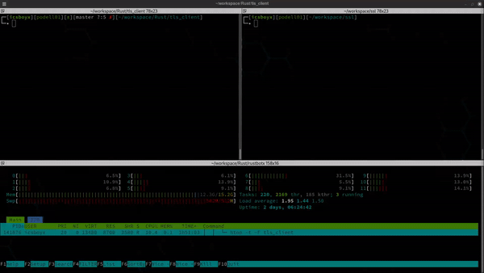

# Rust SSL/TLS Client

This Rust program demonstrates a basic SSL/TLS client that communicates with a server over a secure connection. (This is r/w no-blocking socket example.)
The client sends timestamp payloads to the server, and the server prints the received payloads.

## Dependencies

This program relies on the following crates:

- `chrono`: For timestamp handling
- `ctrlc`: For handling Ctrl+C signals
- `openssl`: For SSL/TLS encryption
- `colored`: For colored output

Make sure to include these dependencies in your `Cargo.toml`:

```toml
[dependencies]
chrono = "0.4"
ctrlc = "3.0"
openssl = "0.10"
colored = "2.0"
```
## Usage
Clone this repository.
Make sure you have Rust and Cargo installed.
Navigate to the repository folder and run the program:

```bash
cargo run
```

## Functionality
The program performs the following tasks:

* Sets up a Ctrl+C signal handler to gracefully terminate the client.
* Creates an OpenSSL SSL connector with no certificate verification.
* Connects to a server over TCP using an SSL stream.
* Reads data from the server and displays it.
* Sends timestamp payloads to the server every second.
* Uses multi-threading to handle reading and writing simultaneously.

##  Note
The server-side code is not included; you need a server listening on localhost:6697.
Using SslVerifyMode::NONE for certificate verification is not recommended for production.
Graceful termination of threads and resources is not handled in this basic example.
Feel free to modify and expand the code as needed for your use case.

## Testing Server
* For the server side you can use openssl native functions:
    Generate a private key (server.key) and server certificate (server.crt)
    ```bash
    openssl req -new -newkey rsa:2048 -days 365 -nodes -x509 -keyout server.key -out server.crt
    ```
* Start the server:
    ```bash
    openssl s_server -brief -accept 6697 -cert server.crt -key server.key
    ```
    *** on the server prompt you can type and send messages to the client side.




## Special Thanks

This project was inspired by the Twitch channel of [Prof. Andrea Pollini](https://www.twitch.tv/profandreapollini) and the supportive Twitch community. Thanks to their encouragement and feedback, this bot was created to enhance the Twitch chat experience. Special thanks also go to the developers of Pygame and gTTS for their excellent libraries. 


## License

This project is licensed under the MIT License - see the [LICENSE](https://www.mit.edu/~amini/LICENSE.md) for details.
